# Flujo Completo de Trivia - Sistema Híbrido Event-Driven

Este documento describe el flujo completo del juego Trivia usando el **sistema híbrido** con eventos WebSocket y countdown timestamp-based.

## 📐 Arquitectura General

```
Lobby → Transition (countdown) → Game Room → Finish
  ↓         ↓                        ↓           ↓
 init   startGame              play rounds   results
```

---

## 🎯 Fase 1: LOBBY (Creación y Configuración)

### Backend: GameMatch::start()

```php
// 1. Master presiona "Iniciar Partida"
POST /api/games/{match}/start

// 2. GameMatch::start()
$this->engine->initialize($match);  // UNA VEZ
event(new GameStartedEvent($this->room));
```

### TriviaEngine::initialize()

**Responsabilidad**: Cargar y guardar configuración

```php
public function initialize(GameMatch $match): void
{
    // 1. Cargar banco de preguntas
    $allQuestions = json_decode(file_get_contents('assets/questions.json'), true);

    // 2. Seleccionar preguntas según config
    $selectedQuestions = $this->selectQuestions($allQuestions, 10, 'mixed', 'mixed');

    // 3. Guardar TODO en _config (inmutable)
    $match->game_state = [
        '_config' => [
            'questions' => $selectedQuestions,
            'time_per_question' => 15,
            'player_ids' => $playerIds,
        ],
        'phase' => 'waiting'
    ];

    // 4. Inicializar módulos automáticamente
    $this->initializeModules($match, [
        'round_system' => ['total_rounds' => count($selectedQuestions)],
        'scoring_system' => ['calculator' => new TriviaScoreCalculator()]
    ]);
}
```

**Estado después**:
```json
{
  "_config": {
    "questions": [...],
    "time_per_question": 15,
    "player_ids": [1, 2, 3]
  },
  "round_system": {
    "current_round": 1,
    "total_rounds": 10
  },
  "scoring_system": {
    "scores": {
      "1": 0,
      "2": 0,
      "3": 0
    }
  },
  "phase": "waiting"
}
```

### Frontend: Redirección a Transition

```javascript
// Evento recibido
channel.listen('.game.started', (data) => {
    window.location.href = `/rooms/${roomCode}/transition`;
});
```

---

## ⏱️ Fase 2: TRANSITION (Countdown Timestamp-Based)

### Frontend: Presence Channel

```javascript
// transition.blade.php
const presenceChannel = Echo.join(`room.${roomCode}`);

presenceChannel.here((users) => {
    updatePlayerStatus(users);
    checkAllConnected();  // Si todos conectados → apiReady()
});
```

### Backend: GameCountdownEvent

```php
// RoomController::apiReady()
POST /api/rooms/{code}/ready

// Cuando todos conectados
event(new GameCountdownEvent($room, 3)); // 3 segundos
```

**Evento emitido**:
```json
{
  "room_code": "ABC123",
  "server_time": 1735140000.123456,  // microtime()
  "duration_ms": 3000,
  "message": "El juego comenzará en..."
}
```

### Frontend: Countdown Sincronizado

```javascript
channel.listen('.game.countdown', (data) => {
    // TimingModule - countdown con requestAnimationFrame (60fps)
    timing.handleCountdownEvent(data, countdownElement, () => {
        // Cuando termina → TODOS llaman initialize-engine
        fetch(`/api/rooms/${roomCode}/initialize-engine`, {
            method: 'POST'
        });
    }, 'game-start');
});
```

**Sincronización Timestamp-Based**:
```javascript
const drift = Date.now() - (serverTime * 1000);

requestAnimationFrame(function update() {
    const now = Date.now() - drift;  // Compensado
    const remainingMs = endTime - now;
    element.textContent = Math.ceil(remainingMs / 1000);

    if (remainingMs > 0) requestAnimationFrame(update);
    else callback();  // ← Ejecuta en el MISMO momento en todos
});
```

### Backend: Lock Protection

```php
// RoomController::apiInitializeEngine()
POST /api/rooms/{code}/initialize-engine

// TODOS los clientes llaman, pero...
if (!$match->acquireRoundLock()) {
    return response()->json(['already_processing' => true], 200);
}

try {
    // SOLO el primer cliente ejecuta
    $match->initializeEngine();
} finally {
    $match->releaseRoundLock();
}
```

---

## 🎮 Fase 3: GAME INITIALIZATION (Post-Countdown)

### Backend: GameMatch::initializeEngine()

```php
public function initializeEngine(): void
{
    $engine = app($engineClass);

    // 1. initialize() ya fue llamado en la Fase 1
    // 2. Iniciar el juego (resetea módulos + llama onGameStart)
    $engine->startGame($this);

    // 3. Actualizar sala a 'playing'
    $this->room->update(['status' => Room::STATUS_PLAYING]);

    // 4. Emitir evento
    event(new GameInitializedEvent($this, $this->game_state));
}
```

### BaseGameEngine::startGame()

```php
public function startGame(GameMatch $match): void
{
    // 1. Resetear módulos automáticamente
    $this->resetModules($match);  // scores a 0, ronda a 1

    // 2. Llamar hook del juego
    $this->onGameStart($match);
}
```

**Estado después del reset**:
```json
{
  "_config": {...},  // ← Sin cambios
  "round_system": {
    "current_round": 1,     // ← Reseteado
    "total_rounds": 10
  },
  "scoring_system": {
    "scores": {
      "1": 0,              // ← Reseteado
      "2": 0,
      "3": 0
    }
  }
}
```

### TriviaEngine::onGameStart()

**Responsabilidad**: Setear estado inicial y emitir primera ronda

```php
protected function onGameStart(GameMatch $match): void
{
    // 1. Leer configuración (NO recalcular)
    $config = $match->game_state['_config'];
    $questions = $config['questions'];

    // 2. Setear estado inicial de Trivia
    $match->game_state = array_merge($match->game_state, [
        'phase' => 'question',
        'current_question_index' => 0,
        'current_question' => $questions[0],
        'player_answers' => [],
        'question_start_time' => now()->timestamp
    ]);

    // 3. Emitir RoundStartedEvent (genérico)
    $roundManager = RoundManager::fromArray($match->game_state);
    event(new RoundStartedEvent(
        match: $match,
        currentRound: 1,
        totalRounds: count($questions),
        phase: 'question',
        timing: $timerInfo  // Con server_time para sincronizar
    ));
}
```

### Frontend: Redirección al Juego

```javascript
channel.listen('.game.initialized', (data) => {
    window.location.replace(`/rooms/${roomCode}`);
});
```

---

## 🏁 Fase 4: GAMEPLAY (Rondas)

### Frontend: Mostrar Pregunta

```javascript
// game.blade.php
channel.listen('.game.round.started', (event) => {
    const question = event.game_state.current_question;
    showQuestion(question);

    // Timing sincronizado
    timing.handleCountdownEvent(
        event.timing,
        timerElement,
        () => console.log('Time expired')
    );
});
```

### Backend: Procesar Respuesta

```php
// Frontend
POST /api/games/{match}/action
{
    "action": "answer",
    "answer": 2
}

// Backend: processAction()
public function processAction(GameMatch $match, Player $player, string $action, array $data): array
{
    // 1. Procesar respuesta
    $actionResult = $this->processRoundAction($match, $player, $data);

    // 2. Strategy decide si terminar
    $roundStatus = $strategy->shouldEnd($match, $actionResult, $roundManager, ...);

    // 3. Si debe terminar
    if ($roundStatus['should_end']) {
        $this->endCurrentRound($match);  // ← Automático
    }

    return $actionResult;
}
```

### Backend: Finalizar Ronda

```php
protected function endCurrentRound(GameMatch $match): void
{
    $this->endQuestion($match);
}

private function endQuestion(GameMatch $match): void
{
    // 1. Calcular puntos
    $scoreManager = ScoreManager::fromArray(...);
    foreach ($activePlayers as $playerId) {
        if ($answerData && $answerData['is_correct']) {
            $scoreManager->awardPoints($playerId, 'correct_answer', [
                'seconds_elapsed' => $answerData['seconds_elapsed'],
                'time_limit' => 15
            ]);
        }
    }

    // 2. Delegar a BaseGameEngine (completeRound hace TODO)
    $this->completeRound($match, $questionResults);
}
```

### BaseGameEngine::completeRound()

**Coordinación automática**:

```php
protected function completeRound(GameMatch $match, array $results): void
{
    // 1. Emitir RoundEndedEvent
    event(new RoundEndedEvent(
        match: $match,
        roundNumber: $roundManager->getCurrentRound(),
        results: $results,
        scores: $scores
    ));

    // 2. Avanzar RoundManager
    $roundManager->nextTurn();

    // 3. Verificar si terminó
    if ($roundManager->isGameComplete()) {
        $this->finalize($match);
        return;
    }

    // 4. Cargar siguiente ronda
    $this->startNewRound($match);  // ← TriviaEngine implementa

    // 5. Emitir RoundStartedEvent
    event(new RoundStartedEvent(...));
}
```

### Frontend: Mostrar Resultados

```javascript
channel.listen('.game.round.ended', (event) => {
    showResults(event.results, event.scores);

    // Esperar siguiente RoundStartedEvent (automático del backend)
});
```

---

## 🏆 Fase 5: FINALIZACIÓN

### Backend: Finalize

```php
public function finalize(GameMatch $match): array
{
    // 1. Cambiar a fase final
    $gameState['phase'] = 'final_results';

    // 2. Calcular ranking
    $scoreManager = ScoreManager::fromArray(...);
    $ranking = $scoreManager->getRanking();

    // 3. Emitir evento
    event(new GameFinishedEvent($match, $ranking, $statistics));

    return ['winner' => $winner, 'ranking' => $ranking];
}
```

### Frontend: Ranking Final

```javascript
channel.listen('.game.finished', (event) => {
    showFinalRanking(event.ranking, event.statistics);
});
```

---

## 📊 Diagrama de Secuencia Completo

```mermaid
sequenceDiagram
    participant M as Master
    participant B as Backend
    participant F1 as Frontend (Master)
    participant F2 as Frontend (Jugador 2)
    participant F3 as Frontend (Jugador 3)

    Note over M,F3: FASE 1: LOBBY
    M->>B: POST /games/{match}/start
    B->>B: engine->initialize() (config)
    B-->>F1: GameStartedEvent
    B-->>F2: GameStartedEvent
    B-->>F3: GameStartedEvent
    F1->>F1: redirect /transition
    F2->>F2: redirect /transition
    F3->>F3: redirect /transition

    Note over M,F3: FASE 2: TRANSITION
    F1->>B: Presence Channel (connected)
    F2->>B: Presence Channel (connected)
    F3->>B: Presence Channel (connected)
    B->>B: All connected!
    F1->>B: POST /ready
    B-->>F1: GameCountdownEvent {server_time, duration_ms}
    B-->>F2: GameCountdownEvent {server_time, duration_ms}
    B-->>F3: GameCountdownEvent {server_time, duration_ms}
    F1->>F1: TimingModule countdown (3...2...1)
    F2->>F2: TimingModule countdown (3...2...1)
    F3->>F3: TimingModule countdown (3...2...1)

    Note over M,F3: Countdown termina (sincronizado)
    F1->>B: POST /initialize-engine
    F2->>B: POST /initialize-engine
    F3->>B: POST /initialize-engine
    B->>B: Lock (F1 wins)
    B->>B: engine->startGame() → onGameStart()
    B-->>F1: GameInitializedEvent
    B-->>F2: GameInitializedEvent
    B-->>F3: GameInitializedEvent
    B-->>F1: RoundStartedEvent (question 1)
    B-->>F2: RoundStartedEvent (question 1)
    B-->>F3: RoundStartedEvent (question 1)
    F1->>F1: redirect /rooms/{code}
    F2->>F2: redirect /rooms/{code}
    F3->>F3: redirect /rooms/{code}

    Note over M,F3: FASE 3: JUEGO
    F2->>B: POST /action {answer: 2}
    B->>B: processAction() → is_correct=true
    B->>B: endCurrentRound() → completeRound()
    B-->>F1: RoundEndedEvent (results, scores)
    B-->>F2: RoundEndedEvent (results, scores)
    B-->>F3: RoundEndedEvent (results, scores)
    B->>B: startNewRound() (question 2)
    B-->>F1: RoundStartedEvent (question 2)
    B-->>F2: RoundStartedEvent (question 2)
    B-->>F3: RoundStartedEvent (question 2)

    Note over M,F3: ... Rondas 3-10 ...

    Note over M,F3: FASE 4: FINALIZACIÓN
    B->>B: isGameComplete() = true
    B->>B: finalize()
    B-->>F1: GameFinishedEvent (ranking)
    B-->>F2: GameFinishedEvent (ranking)
    B-->>F3: GameFinishedEvent (ranking)
```



---

## 🔑 Conceptos Clave

### 1. Separación de Responsabilidades

| Método | Cuándo | Responsabilidad |
|--------|--------|-----------------|
| `initialize()` | UNA VEZ (lobby) | Cargar assets, guardar en `_config` |
| `startGame()` | Post-countdown | Resetear módulos, llamar `onGameStart()` |
| `onGameStart()` | Dentro de `startGame()` | Setear estado inicial, emitir `RoundStartedEvent` |
| `processAction()` | Cada acción | Procesar + decidir si terminar |
| `endCurrentRound()` | Ronda termina | Calcular puntos |
| `startNewRound()` | Siguiente ronda | Cargar siguiente pregunta |
| `finalize()` | Juego termina | Ranking final |

### 2. Estado Inmutable vs Mutable

**Inmutable** (`_config`):
- Preguntas seleccionadas
- Configuración del juego
- IDs de jugadores
- **NUNCA** cambia después de `initialize()`

**Mutable** (resto de `game_state`):
- `phase`: 'waiting' → 'question' → 'results' → 'final_results'
- `current_question_index`: 0 → 1 → 2 → ...
- `player_answers`: {} → {1: {...}} → {1: {...}, 2: {...}}
- `scores`: {1: 0, 2: 0} → {1: 100, 2: 50} → ...

### 3. Eventos Genéricos (Reutilizables)

Trivia **NO** emite eventos específicos. Usa solo eventos genéricos:
- `GameStartedEvent` - Lobby → Transition
- `GameCountdownEvent` - Countdown timestamp-based
- `GameInitializedEvent` - Transition → Game
- `RoundStartedEvent` - Nueva pregunta
- `RoundEndedEvent` - Resultados de pregunta
- `PlayerActionEvent` - Jugador respondió
- `GameFinishedEvent` - Ranking final

### 4. Lock Protection (Race Conditions)

```php
// Escenario: 3 clientes terminan countdown al mismo tiempo
Cliente 1 → POST /initialize-engine → 🔒 Lock adquirido → Ejecuta ✅
Cliente 2 → POST /initialize-engine → ⏸️  Lock ocupado → 200 OK
Cliente 3 → POST /initialize-engine → ⏸️  Lock ocupado → 200 OK

// TODOS reciben GameInitializedEvent y sincronizan
```

### 5. Timestamp-Based Countdown

**No Jobs, No setInterval, Solo Timestamps**:
```javascript
// Backend emite UNA VEZ
{
  server_time: 1735140000.123,  // microtime()
  duration_ms: 3000
}

// Frontend calcula localmente (60fps)
const drift = Date.now() - (serverTime * 1000);
requestAnimationFrame(() => {
    const now = Date.now() - drift;  // Compensado
    const remaining = endTime - now;
    // Todos terminan en el MISMO momento
});
```

---

## 🎓 Ventajas del Sistema Híbrido

1. **Sincronización Perfecta**
   - Countdown timestamp-based (como Fortnite, CS:GO)
   - Compensa lag automáticamente
   - 60fps smooth con `requestAnimationFrame`

2. **Escalabilidad**
   - Backend: 1 evento para N jugadores
   - Sin polling, sin jobs, sin timers en backend
   - Lock protection previene duplicación

3. **Event-Driven Completo**
   - Frontend solo reacciona a eventos
   - Sin `location.reload()`
   - Sincronización real-time con WebSocket

4. **Arquitectura Limpia**
   - `initialize()` - Una vez, config inmutable
   - `startGame()` - Reset automático de módulos
   - `onGameStart()` - Hook específico del juego
   - Eventos genéricos reutilizables

---

## 📚 Referencias

- `BaseGameEngine.php` - Motor base con flujo híbrido
- `TriviaEngine.php` - Implementación completa
- `GameMatch.php` - Coordinador de inicialización
- `RoomController.php` - Endpoints de transición
- `TimingModule.js` - Countdown timestamp-based
- `transition.blade.php` - Vista de transición

---

**Sistema Híbrido - Gaming Industry Standard** 🎮
